# 🍽️ Eatfolio

<div align="center">
  
  
  **AI 기반 스마트 식단 관리 서비스**
  
  [](https://flutter.dev/)
  [](https://fastapi.tiangolo.com/)
  [](https://www.python.org/)
  [](https://firebase.google.com/)
</div>

---

## 📱 서비스 소개


오늘 먹은 음식을 간단히 기록하고 싶나요?  
**eatfolio**는 음식 사진 한 장으로 나만의 식단 다이어리를 만들어줍니다.  

- 사진을 찍어 올리면 자동으로 피드에 저장 📸  
- 날짜별로 내가 먹은 음식들을 한눈에 확인 📅  
- AI가 영양소를 분석해 식단 관리까지 도와줍니다 🥗  

eatfolio는 단순히 건강 관리용 앱이 아니라,  
음식을 통해 추억을 기록하고 나만의 이야기를 남길 수 있는 서비스입니다.

### ✨ 주요 특징
- 🤖 **이중 AI 분석 시스템**: YOLOv3 + ResNet 기반 음식 분석 + Gemini API 폴백
- 📊 **실시간 영양 분석**: 칼로리, 단백질, 지방 등 상세 영양성분 제공
- 📱 **크로스 플랫폼**: Flutter 기반 iOS/Android 앱
- 🔥 **실시간 동기화**: Firebase 기반 클라우드 데이터베이스
- 📈 **주간 식단 분석**: AI 기반 개인 맞춤형 피드백 및 추천

---

## 🏗️ 프로젝트 구조

```
eatfolio/
├── 📱 eatfolio/                 # Flutter 모바일 앱
│   ├── lib/                    # Dart 소스 코드 (UI, 비즈니스 로직)
│   ├── android/                # Android 네이티브 설정
│   ├── ios/                    # iOS 네이티브 설정
│   ├── assets/                 # 이미지, 폰트, 아이콘
│   ├── functions/              # Firebase Cloud Functions (Node.js 22, 2nd Gen)
│   │   ├── index.js            # Firestore 트리거, 통계 계산
│   │   ├── backfill.js         # 기존 데이터 백필 스크립트
│   │   └── package.json        # Node.js 의존성
│   └── pubspec.yaml            # Flutter 의존성
├── 🖥️ backend/                 # Python FastAPI 백엔드 (AI 분석 서버)
│   ├── main.py                 # FastAPI 서버 메인 파일
│   ├── prompts/                # AI 프롬프트 템플릿
│   ├── requirements.txt        # Python 의존성
│   └── env.example            # 환경변수 예시
└── README.md                   # 프로젝트 설명서
```

---
## 실제 화면 예시

<details>
<summary>스플래시 & 로그인</summary>

<table>
  <tr>
    <td align="center"></td>
    <td align="center">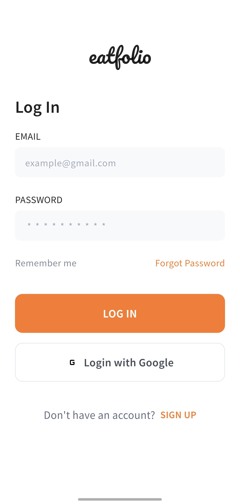</td>
  </tr>
  <tr>
    <td align="center">앱 실행 시 가장 먼저 보이는 화면으로, LOGIN과 SIGN UP 버튼을 통해 접근할 수 있습니다.</td>
    <td align="center">이메일/비밀번호 또는 Google 계정으로 로그인할 수 있으며, 회원가입과 비밀번호 찾기 기능도 제공됩니다.</td>
  </tr>
</table>

</details>

<details>
<summary>홈 & 식사 등록</summary>

<table>
  <tr>
    <td align="center">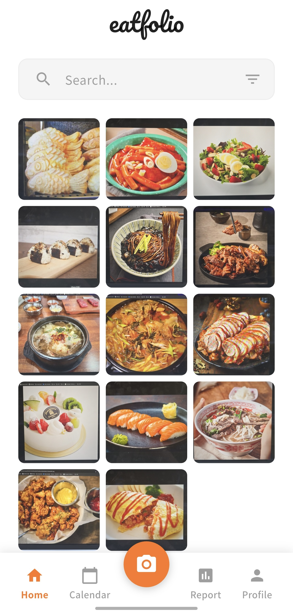</td>
    <td align="center">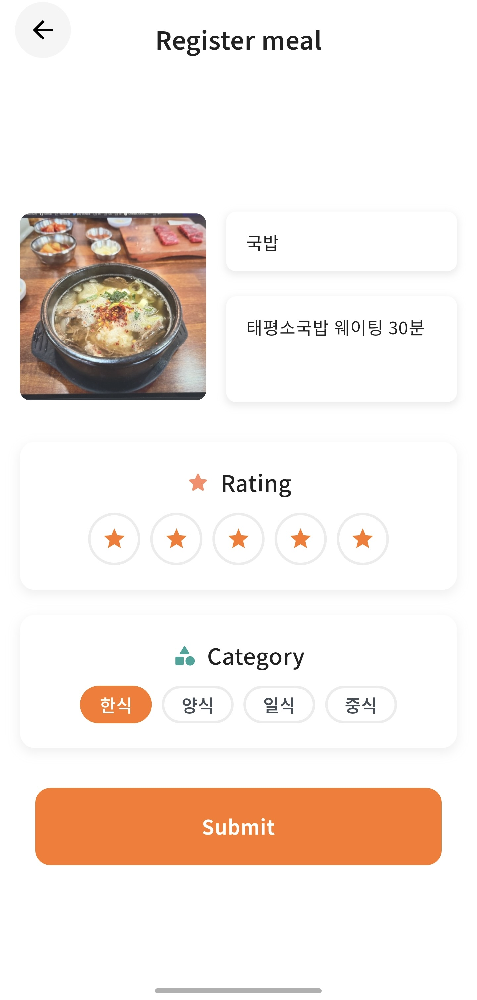</td>
  </tr>
  <tr>
    <td align="center">업로드된 음식 사진들을 한눈에 볼 수 있고, 검색 기능을 통해 원하는 음식 기록을 빠르게 찾을 수 있습니다.</td>
    <td align="center">음식 사진, 이름, 메모, 별점, 카테고리 등을 입력해 식사를 기록할 수 있습니다.</td>
  </tr>
</table>

</details>

<details>
<summary>캘린더 & 식사 상세</summary>

<table>
  <tr>
    <td align="center">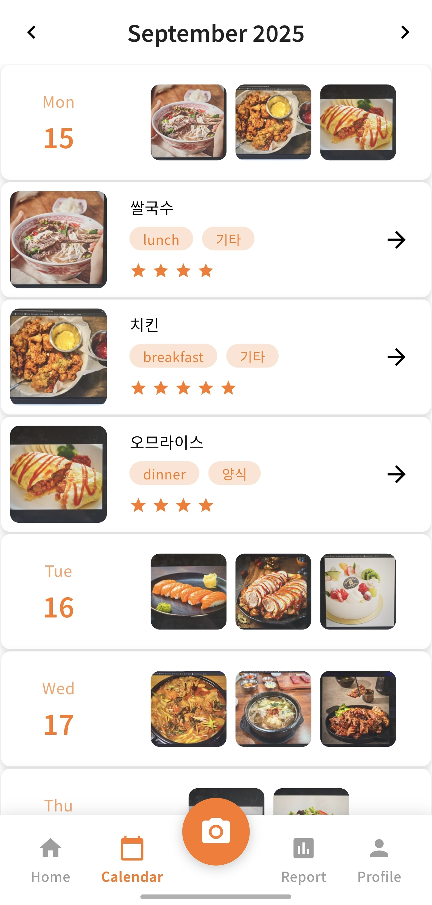</td>
    <td align="center">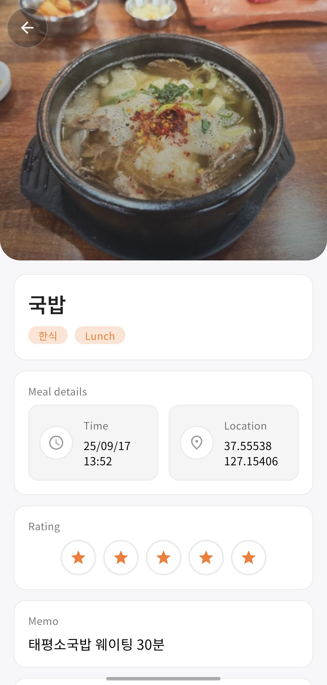</td>
  </tr>
  <tr>
    <td align="center">날짜별로 기록한 식단을 한눈에 확인할 수 있으며, 각 식사를 클릭해 상세 정보를 확인할 수 있습니다.</td>
    <td align="center">음식 사진, 카테고리, 시간, 위치, 별점, 메모 등이 표시되며 기록한 내용을 다시 확인할 수 있습니다.</td>
  </tr>
</table>

</details>

<details>
<summary>영양 상세 & 리포트</summary>

<table>
  <tr>
    <td align="center">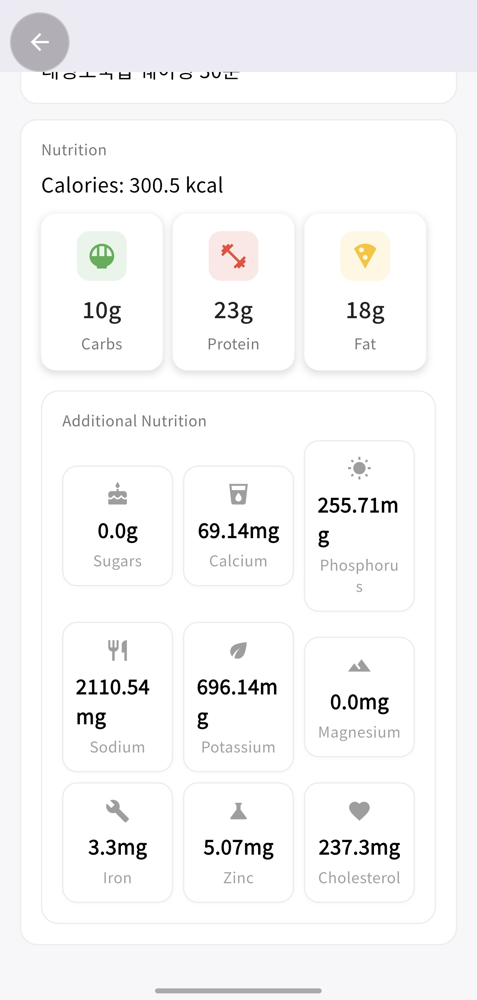</td>
    <td align="center">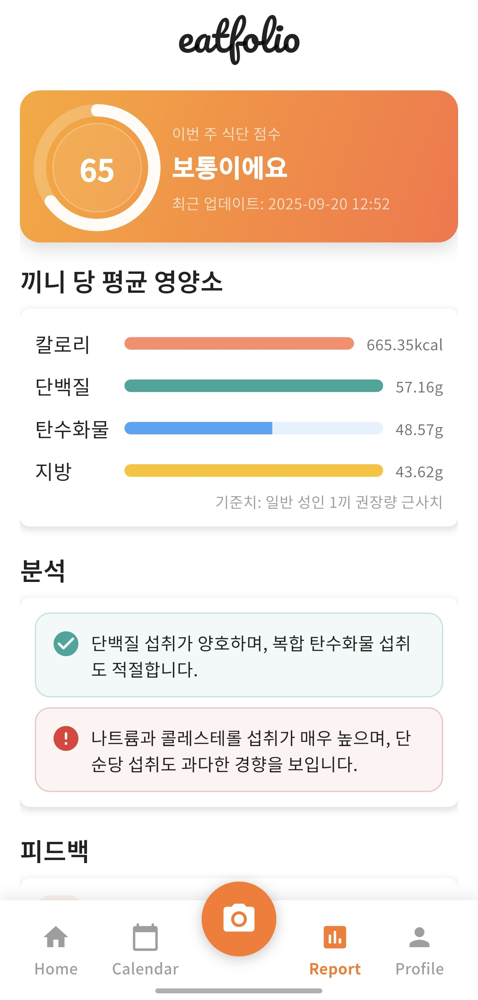</td>
  </tr>
  <tr>
    <td align="center">칼로리, 탄단지(탄수화물/단백질/지방), 나트륨, 칼슘 등 세부 영양 정보를 확인할 수 있습니다.</td>
    <td align="center">주간 식단 점수, 평균 섭취 영양소, 분석 및 피드백을 통해 자신의 식습관을 점검할 수 있습니다.</td>
  </tr>
</table>

</details>

<details>
<summary>프로필</summary>

<table>
  <tr>
    <td align="center">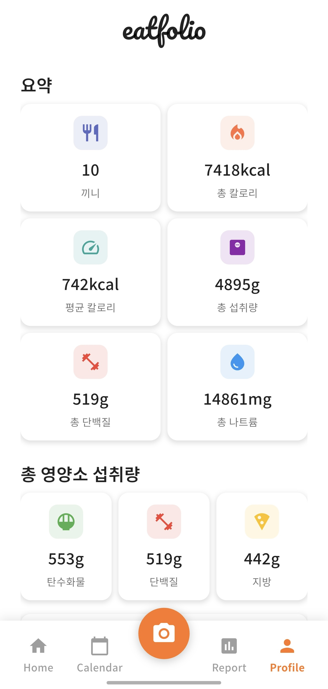</td>
  </tr>
  <tr>
    <td align="center">총 섭취 칼로리, 평균 칼로리, 단백질/탄수화물/지방 등 누적 영양 성분 데이터를 한눈에 볼 수 있습니다.</td>
  </tr>
</table>

</details>

---
## 🤖 AI 분석 시스템

### **이중 AI 분석 아키텍처**

Eatfolio는 **2단계 AI 분석 시스템**을 통해 높은 정확도의 음식 분석을 제공합니다.

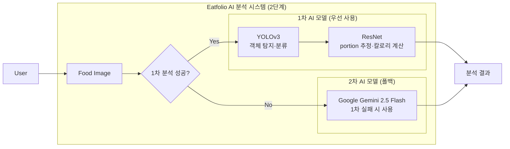
#### **1차 AI 모델 (우선 사용)**
- **YOLOv3**: 음식 객체 탐지 및 분류
- **ResNet**: 양(portion) 추정 및 칼로리 계산

#### **2차 AI 모델 (폴백)**
- **Google Gemini 2.5 Flash**: 1차 모델 실패 시 사용

### **실제 AI 분석 예시**

#### 🍣 **새우초밥 분석 (AI 모델 분석 성공)**

**분석 상황**: YOLOv3 성공적으로 "새우초밥" 분류 + ResNet으로 양 추정

<div align="center">
<table>
<tr>
<td width="300">
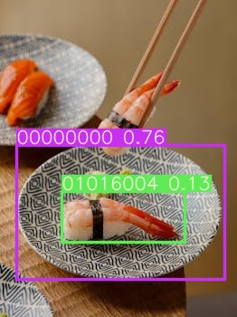
</td>
<td>
**AI 분석 결과**:

```json
{
  "analyze": true,
  "predicted_food_name": "새우초밥",
  "nutrition_info": {
    "carbohydrate": 69.54,    // 탄수화물 (g)
    "sugars": 2.99,          // 당류 (g)
    "fat": 1.21,             // 지방 (g)
    "protein": 22.74,        // 단백질 (g)
    "calcium": 73.39,        // 칼슘 (mg)
    "phosphorus": 341.13,    // 인 (mg)
    "sodium": 1396.75,       // 나트륨 (mg)
    "potassium": 372.75,     // 칼륨 (mg)
    "magnesium": 2.6,        // 마그네슘 (mg)
    "iron": 2.62,            // 철 (mg)
    "zinc": 2.17,            // 아연 (mg)
    "cholesterol": 138.33,   // 콜레스테롤 (mg)
    "trans_fat": 0.0         // 트랜스지방 (g)
  },
  "calories": 395.54,        // 칼로리 (kcal)
  "weight_g": 250,           // 무게 (g)
  "food_category": "일식",    // 음식 카테고리
  "food_name": "초밥",       // 음식명
  "meal_time": "dinner"      // 식사 시간
}
```
</td>
</tr>
</table>
</div>

**YOLOv3 객체 탐지 결과**:
- **클래스 1**: 00000000 - 보라색 바운딩 박스
- **클래스 2**: 01016004 - 녹색 바운딩 박스

**ResNet 양 추정 결과**:
- **예측**: Q4 (확률: 0.6451)
- **처리 시간**: 0.004초

#### 🐟 **참치회 분석 (Gemini API 폴백)**

**분석 상황**: YOLOv3가 "00000000"으로 인식 실패 → Gemini API로 폴백

<div align="center">
<table>
<tr>
<td width="300">
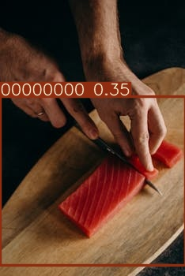
</td>
<td>
**AI 분석 결과**:

```json
{
  "analyze": true,
  "predicted_food_name": "참치회",
  "nutrition_info": {
    "carbohydrate": 0.1,      // 탄수화물 (g)
    "sugars": 0.0,           // 당류 (g)
    "fat": 12.0,             // 지방 (g)
    "protein": 48.0,         // 단백질 (g)
    "calcium": 30.0,         // 칼슘 (mg)
    "phosphorus": 500.0,     // 인 (mg)
    "sodium": 90.0,          // 나트륨 (mg)
    "potassium": 700.0,      // 칼륨 (mg)
    "magnesium": 50.0,       // 마그네슘 (mg)
    "iron": 2.5,             // 철 (mg)
    "zinc": 0.8,             // 아연 (mg)
    "cholesterol": 75.0,     // 콜레스테롤 (mg)
    "trans_fat": 0.0         // 트랜스지방 (g)
  },
  "calories": 220.0,         // 칼로리 (kcal)
  "weight_g": 200.0          // 무게 (g)
}
```
</td>
</tr>
</table>
</div>

---

## 🚀 기술 스택

### **Frontend (Flutter)**
- **Flutter 3.16+**: 크로스 플랫폼 모바일 앱 개발
- **Dart**: 프로그래밍 언어
- **Provider/Riverpod**: 상태 관리
- **HTTP**: 백엔드 API 통신

### **Backend (FastAPI)**
- **FastAPI**: 고성능 Python 웹 프레임워크
- **Uvicorn**: ASGI 서버
- **Pydantic**: 데이터 검증
- **Firebase Admin SDK**: 데이터베이스 연동

### **AI/ML**
- **YOLOv3**: 실시간 객체 탐지 및 분류
- **ResNet**: 이미지 분류 및 양 추정
- **Google Gemini API**: 자연어 기반 음식 분석
- **CUDA**: GPU 가속 처리

### **Infrastructure**
- **Firebase Firestore**: 실시간 NoSQL 데이터베이스
- **Firebase Authentication**: 사용자 인증
- **Docker**: 컨테이너화
- **GitHub Actions**: CI/CD

---

## 📱 주요 기능

### **1. AI 음식 인식**
- 📸 **사진 촬영**: 음식 사진을 촬영하여 업로드
- 🤖 **자동 분석**: AI가 음식 종류와 양을 자동 인식
- 📊 **영양 정보**: 상세한 영양성분 및 칼로리 제공

### **2. 식단 관리**
- 📅 **일일 기록**: 매일의 식사 기록 관리
- 📈 **주간 분석**: 7일간의 식단 패턴 분석
- 🎯 **목표 설정**: 개인 맞춤형 영양 목표 설정

### **3. AI 피드백**
- 💡 **개인 맞춤 조언**: AI 기반 식단 개선 제안
- 🍽️ **추천 식사**: 균형 잡힌 식단 구성 추천
- 📊 **영양 점수**: 종합적인 영양 균형 점수

### **4. 데이터 동기화**
- ☁️ **클라우드 저장**: 모든 데이터 자동 동기화
- 🔒 **보안**: Firebase 보안 규칙으로 데이터 보호

---
## 🔬 AI Hub 데이터셋 참고

본 프로젝트의 AI 모델은 [AI Hub의 음식 이미지 및 영양정보 텍스트 데이터셋](https://aihub.or.kr/aihubdata/data/view.do?currMenu=115&topMenu=100&aihubDataSe=realm&dataSetSn=74)을 참고하여 설계되었습니다.

**참고 데이터셋 특징:**
- 한국인 다빈도 섭취 외식메뉴와 한식메뉴 400종
- 84.5만장의 고품질 이미지 (500만 화소 이상)
- 칼로리, 염분, 당도 등 상세 영양성분
- 100건 이상의 정밀 어노테이션
